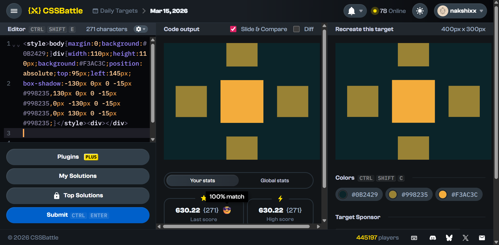

# CSS Battle — Cross Pattern


## What is CSS Battle?

[CSS Battle](https://cssbattle.dev) is a coding challenge where the goal is to
replicate a target image using the smallest amount of HTML and CSS possible.
Your score is based on how closely your output matches the target pixel-for-pixel.
The fewer characters you use, the higher your ranking on the leaderboard.

The constraints force you to think creatively — instead of writing clean,
readable code, you look for CSS tricks that let one element do the work of many.

---

## The Target

Five squares arranged in a plus/cross shape on a dark teal background.

- A bright orange center square
- Four smaller olive/gold squares extending outward in each cardinal direction
- Canvas size: 400px × 300px

---

## Final Solution
```html
<style>
  body {
    margin: 0;
    background: #0B2429;
  }
  div {
    width: 110px;
    height: 110px;
    background: #F3AC3C;
    position: absolute;
    top: 95px;
    left: 145px;
    box-shadow:
      -130px   0px  0  -15px  #998235,   /* left   */
        130px   0px  0  -15px  #998235,   /* right  */
          0px  -130px  0  -15px  #998235,   /* top    */
          0px   130px  0  -15px  #998235;   /* bottom */
  }
</style>
<div></div>
```

---

## Concepts Explained

### 1. The Canvas — `body` styling
```css
body {
  margin: 0;
  background: #0B2429;
}
```

Browsers apply a small default margin to the `<body>` element. If you don't
reset it with `margin: 0`, your design will be slightly offset from the edges
of the canvas.

`background: #0B2429` sets the deep teal colour that fills the entire canvas.
Every colour in this battle comes from the provided palette:
- `#0B2429` — dark teal (background)
- `#998235` — olive gold (satellite squares)
- `#F3AC3C` — bright orange (center square)

---

### 2. Positioning — `position: absolute`
```css
position: absolute;
top: 95px;
left: 145px;
```

By default, HTML elements stack vertically in the document flow. `position: absolute`
takes the element completely out of that flow and lets you place it at exact
pixel coordinates relative to its nearest positioned ancestor — in this case,
the `<body>`.

`top` measures the distance from the top edge of the canvas down to the top
edge of the element. `left` measures from the left edge of the canvas to the
left edge of the element.

The canvas is 400×300px. With a 110px square:
- To center horizontally: `(400 - 110) / 2 = 145px` → `left: 145px` ✓
- To center vertically: `(300 - 110) / 2 = 95px` → `top: 95px` ✓

---

### 3. The `box-shadow` trick

This is the core insight of the solution. Instead of creating five separate
HTML elements, `box-shadow` lets a single `div` cast multiple coloured shadows —
each one acting as an independent visual rectangle.

#### The syntax
```css
box-shadow: offsetX  offsetY  blur  spread  color;
```

You can stack as many shadows as you want by separating them with commas.
They render in order, back to front, behind the element itself.

| Property | What it does |
|----------|-------------|
| `offsetX` | Moves the shadow left (negative) or right (positive) |
| `offsetY` | Moves the shadow up (negative) or down (positive) |
| `blur` | Controls edge softness. `0` = perfectly sharp edges |
| `spread` | Grows (positive) or shrinks (negative) the shadow size relative to the element |
| `color` | Any valid CSS colour |

#### Why `blur: 0`?

CSS Battle requires pixel-perfect matches. Any blur creates soft, feathered
edges that bleed into surrounding pixels — instantly dropping your score. Hard
`0` blur keeps every edge razor-sharp, exactly like the target rectangles.

#### Why `spread: -15px`?

The satellite squares in the target are visibly smaller than the center square.
The `div` is 110×110px. A spread of `-15px` shrinks the shadow by 15px on
**each side**, giving an effective size of:
```
110px - (2 × 15px) = 80px
```

So each satellite renders as an 80×80px square — smaller than the 110×110px
center, matching the target proportions.

#### Why `±130px` for the offsets?

The offset moves the shadow's center point, not its edge. To position a
satellite directly adjacent to (but not overlapping) the center square, you
need to move it at least half the center width + half the shadow width:
```
(110 / 2) + (80 / 2) = 55 + 40 = 95px minimum to touch edges
```

Using `130px` adds a visible gap between the center and satellites, matching
the spacing seen in the target image. This was found by iterating visually
against the target.

#### The four shadows broken down
```css
box-shadow:
  -130px    0px  0  -15px  #998235,  /* left:   shift left,  no vertical movement  */
   130px    0px  0  -15px  #998235,  /* right:  shift right, no vertical movement  */
     0px  -130px  0  -15px  #998235,  /* top:    no horizontal, shift up            */
     0px   130px  0  -15px  #998235;  /* bottom: no horizontal, shift down          */
```

Each shadow only moves along one axis — either horizontal or vertical — keeping
the cross pattern perfectly symmetrical.

---

### 4. Why only one `<div>`?

CSS Battle scores are partly based on character count. Every extra HTML element
adds bytes. The naive solution uses five `<div>` elements — one per square.
The `box-shadow` approach collapses all five into one, saving roughly 60–80
characters and demonstrating a deeper understanding of CSS rendering.

This is a common pattern in CSS Battle: ask yourself "what CSS property can
paint multiple visual shapes from a single element?" — `box-shadow`,
`outline`, `border`, and `clip-path` are frequent answers.

---
## Results



## Stats

| | |
|---|---|
| Elements | 1 `<div>` |
| Characters | ~271 |
| Score | **100%** |

---

## Key Takeaways

- Always reset `margin: 0` on `body` to avoid canvas offset bugs
- `position: absolute` with `top`/`left` gives pixel-perfect placement
- `box-shadow` can render multiple independent coloured rectangles from one element
- `blur: 0` is mandatory for sharp-edged CSS Battle shapes
- Negative `spread` shrinks shadows — useful for making satellites smaller than their parent element
